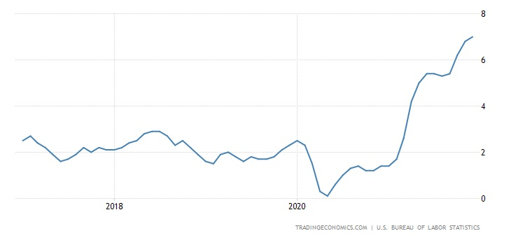

# Time Series Model of Stocks During Hyperinflation

## Summary

According to the latest figures issued by the US Department of Labor, inflation in the United States reached a three-decade high last month, with prices of consumer goods and services rising by 7% year over year.

###               Current US Inflation

Energy production bottlenecks, supply chain disruptions, and a post-pandemic boost in demand have contributed to the rise in food, gas, and housing prices. Inflation worries are also weakening pay and job increases that had aided the economy's faster-than-expected recovery from the coronavirus crisis.

## Business Problem

Despite the Federal Reserve's repeated denials of requests to raise interest rates, referring to inflation fears as "transitory," the political repercussions of rising prices may eventually force the government to act. The stock market has responded gingerly to the news, with the benchmark S&P 500 index not dropping immediately. On the other hand, Morgan Stanley anticipates that if nothing changes, the index might fall by as much as 20% in the following months. Investors are rushing to protect their growth-oriented portfolios against danger in the current environment.

Traditional wisdom holds that dividend-paying, stable firms in the value category and gold are the best inflation hedges. However, the economy has altered so dramatically in recent years that the meaning of "value stock" has also shifted. Before purchasing for a crisis, investors should think about pricing power and worldwide market reach. Viewed in this context, some of the top inflation-proof stocks to buy now include Apple Inc. (NASDAQ: AAPL), Adobe Inc. (NASDAQ: ADBE), and MercadoLibre, Inc. (NASDAQ: MELI), among others modeled within this project.

The time series model intends to predict the risk and potential return on investment for a small-sized portfolio that wishes to diversify itself during times of hyperinflation.

## Data

The stocks analyzed and modeled using facebook's Prophet algorithm are the following:

Apple Inc. - AAPL

Stanley Black & Decker, Inc. - SWK

Newmont Corp. - NEM

EPAM Systems Inc. - EPAM

Aptiv PLC - APTV

Adobe Inc. ADBE

Federal Realty Investment Trust - FRT

Altria Group Inc. - MO

Trade Desk Inc. - TTD

Mercadolibre Inc. - MELI

## Results

Root Mean Square Error (RMSE) is the standard deviation of the residuals (prediction errors). Residuals are a measure of how far from the regression line data points are; RMSE is a measure of how spread out these residuals are. In other words, it tells you how concentrated the data is around the line of best fit.

After training a Prophet model, the top-performing stocks with the most significant ROI and lowest RMSE were the following:

AAPL - ROI: 47.4% | RMSE: 33.6

ADBE - ROI: 55% | RMSE: 70.9

APTV - ROI: 43.2% | RMSE: 30.4

EPAM - ROI: 46.8% | RMSE: 81.31

NEM - ROI: 65.6% | RMSE: 15.5

SWK - ROI: 57.7% | RMSE: 36.5

